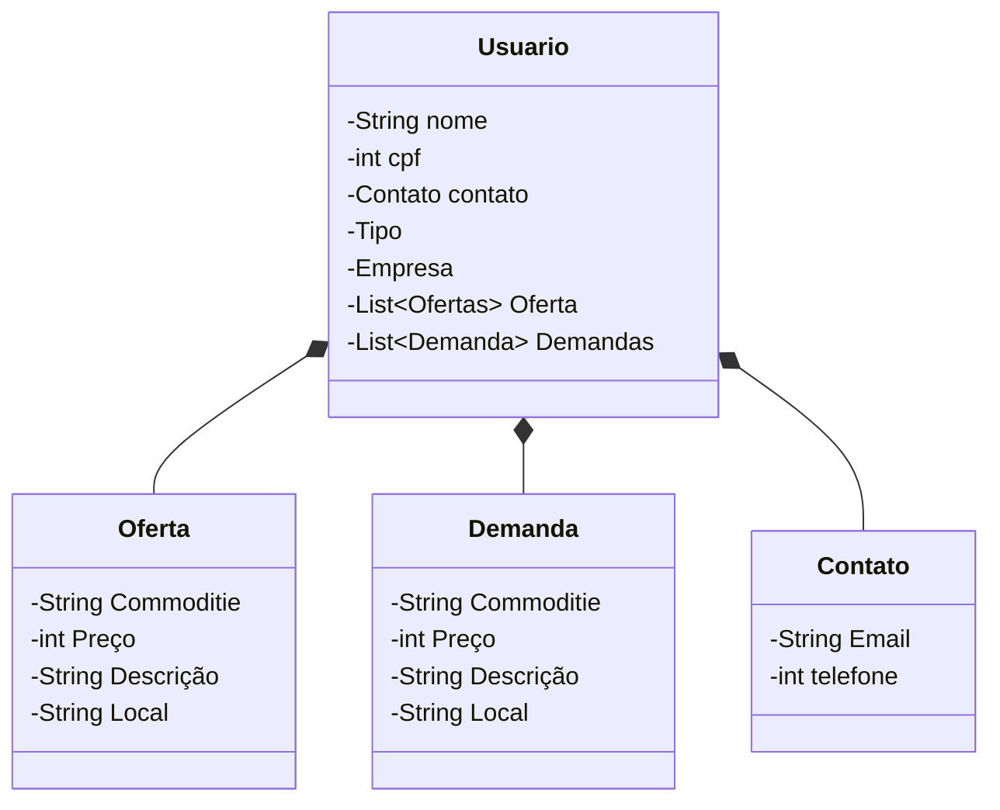

## Diagrama de Classes

```mermaid
classDiagram
    Usuario : -String nome
    Usuario : -int cpf
    Usuario : -Contato contato
    Usuario : -Tipo
    Usuario : -Empresa
    Usuario : -List~Ofertas~ Oferta
    Usuario : -List~Demanda~ Demandas
    Usuario *-- Oferta
    Usuario *-- Demanda
    Usuario *-- Contato
    Oferta : -String Commoditie
    Oferta : -int Preço
    Oferta : -String Descrição
    Oferta : -String Local
    Demanda : -String Commoditie
    Demanda : -int Preço
    Demanda : -String Descrição
    Demanda : -String Local
    Contato : -String Email
    Contato : -int telefone
```
