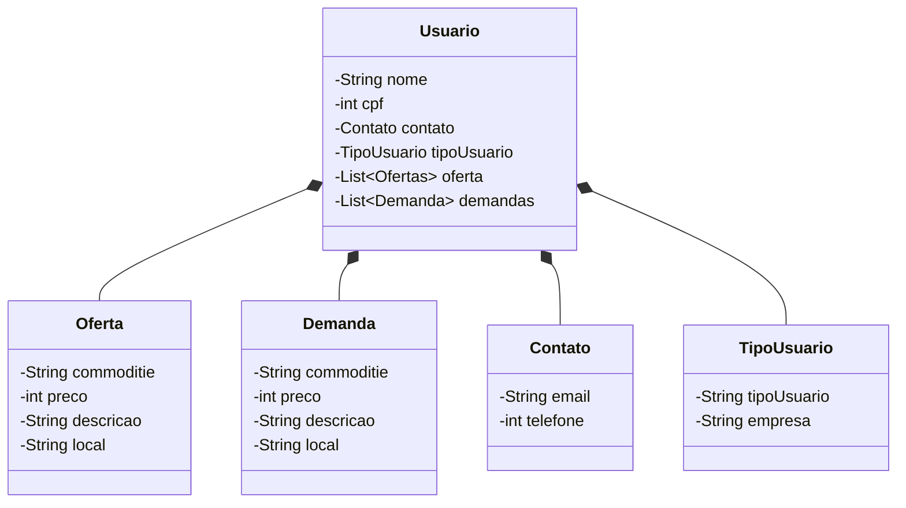

## Diagrama de Classes

```mermaid
classDiagram
    Usuario : -String nome
    Usuario : -int cpf
    Usuario : -Contato contato
    Usuario : -TipoUsuario tipoUsuario
    Usuario : -List~Ofertas~ oferta
    Usuario : -List~Demanda~ demandas
    Usuario *-- Oferta
    Usuario *-- Demanda
    Usuario *-- Contato
    Usuario *-- TipoUsuario
    Oferta : -String commoditie
    Oferta : -int preco
    Oferta : -String descricao
    Oferta : -String local
    Demanda : -String commoditie
    Demanda : -int preco
    Demanda : -String descricao
    Demanda : -String local
    Contato : -String email
    Contato : -int telefone
    TipoUsuario : -String tipoUsuario
    TipoUsuario : -String empresa
    
```
