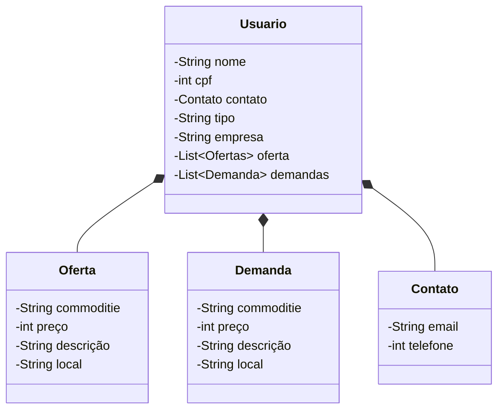

## Diagrama de Classes

```mermaid
classDiagram
    Usuario : -String nome
    Usuario : -int cpf
    Usuario : -Contato contato
    Usuario : -String tipo
    Usuario : -String empresa
    Usuario : -List~Ofertas~ oferta
    Usuario : -List~Demanda~ demandas
    Usuario *-- Oferta
    Usuario *-- Demanda
    Usuario *-- Contato
    Oferta : -String commoditie
    Oferta : -int preço
    Oferta : -String descrição
    Oferta : -String local
    Demanda : -String commoditie
    Demanda : -int preço
    Demanda : -String descrição
    Demanda : -String local
    Contato : -String email
    Contato : -int telefone
```
